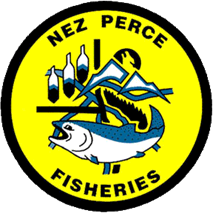

<!-- README.md is generated from README.Rmd. Please edit that file -->

```{r, echo = FALSE}
knitr::opts_chunk$set(
  collapse = TRUE,
  comment = "#>",
  fig.path = "README-"
)
```

# SFSR In-season Escapement Estimates <a href='https://github.com/NPTfisheries/sfsr_inseason'></a>

## Live Report

**Most Current In-Season Escapement Estimates:**

https://nptfisheries.github.io/sfsr_inseason/

The report is updated throughout the spring-summer Chinook salmon return season as new PIT-tag observations become available.

## Description

This repository contains data, scripts, and reporting tools used to estimate in-season escapement of sp/sum Chinook salmon returning to the South Fork Salmon River.

Estimates are derived from PIT-tag detections at arrays throughout the South Fork Salmon River and are expanded using tagging rates and array-specific detection efficiencies. Results are intended to support monitoring of hatchery- and natural-origin returns and in-season fisheries management.

## Authors

- Mike Ackerman  
  Research Scientist  
  Nez Perce Tribe Fisheries Resources Management  
  Research Division

- Ryan N. Kinzer  
  Fisheries Data Analysis Coordinator  
  Nez Perce Tribe Fisheries Resources Management  
  Research Division
  
- Jason Vogel  
  Director  
  Nez Perce Tribe Fisheries Resources Management  
  Research Division
  
## Questions

Please reach out to mikea@nezperce.org

