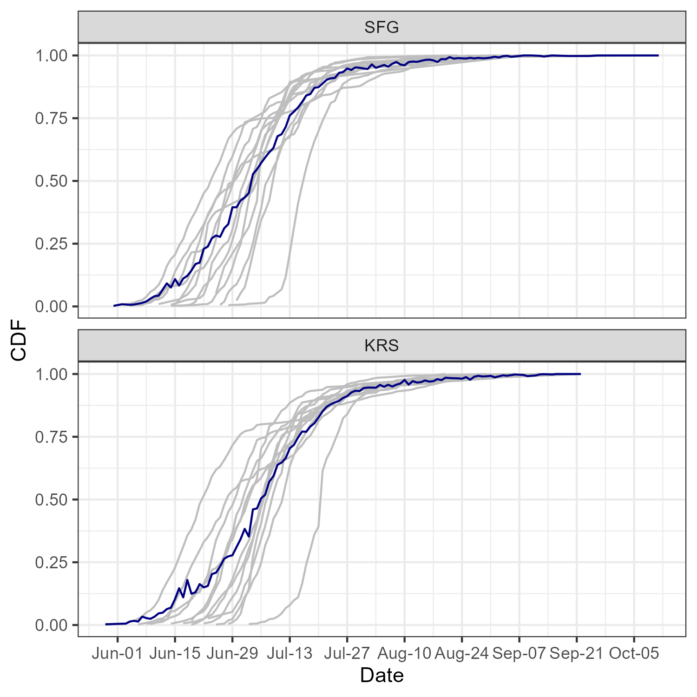

```{r setup, include=FALSE}
library(knitr)
library(kableExtra)

opts_chunk$set(echo = FALSE, message = FALSE, error = FALSE,
                      warning = FALSE)

options(knitr.kable.NA = '-')
```

```{r load-data}
load('../data/expansion.rda') 
```

## Summary 
* Current PIT-tag expansions at KRS (as of July 17th):
  * 655 natural-origin fish estimated from 118 observed tags
  * 560 integrated fish estimated from 80 tags with a ratio of approximately 7 fish/tag
* KRS was non-operational: 7/10, 7/11, 7/14, 7/15, and 7/16
  * Integrated and natural-origin PIT-tag passage during this period is estimated as $\le$ 10 for each group.
  * additional 70 integrated fish
  * additional 56 natural-origin
* Ad-intact fish currently estimated above KRS: 1,341
* The average passage date of $\ge$ 75% of the total return across KRS is July 15th (Figure 1).
* End of season ad-intact estimate: 1,788

## Assumptions
* 100% detection efficiency at KRS
* Static interpolation rate of 2 tags when observations are typically decreasing.
* Integrated fish observed at KRS is approximately 100 fish higher than the estimate at LGR.
* Integrated tag ratio of 7 is slighter higher than actual rate for each release group.

```{r run-fig, fig.width=5, fig.height=5, fig.cap = "Run-timing of SFSR hatchery (segregated and integrated) and natural origin returns across PIT-arrays. The grey lines indicate individual spawn year returns for \n 2010-2022, and the dark blue line shows the average cumulative proportion of returns for each day."}

```
